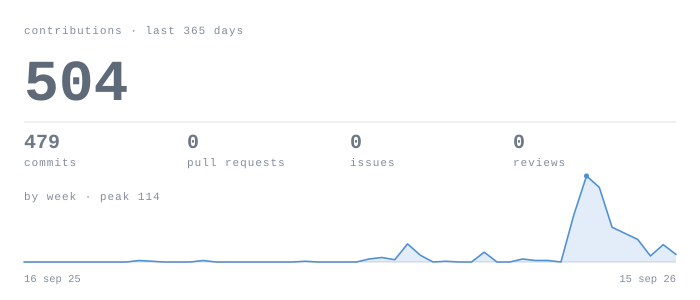
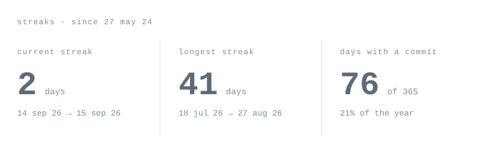
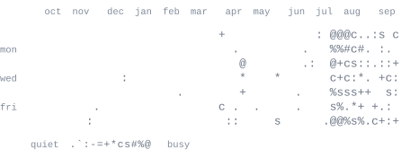
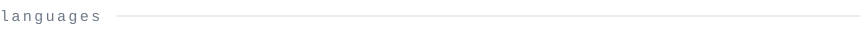
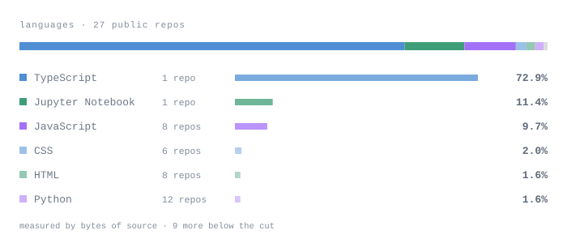

 

> **Ayush Mourya** — CSE undergrad at GD Goenka University, Gurgaon.
> Full-stack by trade, moving deliberately toward data engineering.
> Every graphic below is drawn inside this repository. No third-party widgets,
> nothing that can rate-limit or go dark.

 

Most of my hands-on work has been full-stack — APIs, admin panels, UI
shipped across three internships. Useful, but the part I kept coming back
to on my own time was the layer underneath all of it: pulling raw data,
cleaning it up, turning it into something someone can actually use.
That pull is what now steers most of what I build.

<samp>now</samp> &nbsp;&nbsp;&nbsp;&nbsp;&nbsp; SQL and ETL fundamentals, properly rather than skimmed
<samp>built</samp> &nbsp;&nbsp;&nbsp; a Python ETL pipeline over the CoinGecko API, and a tech-news
&nbsp;&nbsp;&nbsp;&nbsp;&nbsp;&nbsp;&nbsp;&nbsp;&nbsp;&nbsp; feed that refreshes itself on GitHub Actions
<samp>solved</samp> &nbsp;&nbsp; 100+ DSA problems on LeetCode and GeeksforGeeks, all in Python
<samp>placed</samp> &nbsp;&nbsp; 3rd at Syntax Sprint '25, my university's hackathon

 

 

 

<samp>languages &nbsp;&nbsp;&nbsp; Python · SQL · JavaScript · HTML · CSS</samp>
<samp>data &nbsp;&nbsp;&nbsp;&nbsp;&nbsp;&nbsp;&nbsp;&nbsp; Pandas · NumPy · MySQL · REST APIs · ETL pipelines</samp>
<samp>web &nbsp;&nbsp;&nbsp;&nbsp;&nbsp;&nbsp;&nbsp;&nbsp;&nbsp; React · Node · Express · Tailwind · MongoDB</samp>
<samp>tools &nbsp;&nbsp;&nbsp;&nbsp;&nbsp;&nbsp;&nbsp; Git · GitHub Actions · DBeaver · Postman · VS Code</samp>

 

**Cryptocurrency ETL pipeline**
<samp>python · pandas · numpy</samp>
Modular extract–transform–load over the top 20 coins from the CoinGecko
API. Structured logging, explicit handling for timeouts and HTTP errors,
cleaned frames exported as reports.

**Tech Pulse**
<samp>react · vite · tavily · groq · github actions</samp>
A tech-news feed that keeps itself current — Tavily sources the content,
Groq summarises it, and a scheduled action refreshes the whole thing with
no manual trigger.

**AI Resume Builder**
<samp>react · tailwind</samp>
Responsive resume builder with several templates, live preview and
per-section AI suggestions. Team project; I worked on the frontend and
the interaction details.

 

<samp>oct 2025 – jan 2026 &nbsp;&nbsp; full stack developer intern · Webarclight</samp>
<samp>jun – sep 2025 &nbsp;&nbsp;&nbsp;&nbsp;&nbsp;&nbsp;&nbsp; web developer intern · Uptoskills</samp>
<samp>jun – sep 2025 &nbsp;&nbsp;&nbsp;&nbsp;&nbsp;&nbsp;&nbsp; hr intern · GoMechanic</samp>

Named Intern of the Month at Uptoskills, August 2025. Wrote a research
report on the future of IT after an industry exposure program at the
IT Ministry.

 

[portfolio](https://ayush-portfolio-dnef.vercel.app/) · [linkedin](https://www.linkedin.com/in/ayush-mourya-7999a428a/) · [leetcode](https://leetcode.com/ayushmourya43) · [email](mailto:ayushmourya43@gmail.com)

 

<samp>The portrait, the headings and the four data cards are SVGs generated in this
repository — see <a href="HOW-IT-WORKS.md">HOW-IT-WORKS.md</a>. Set in JetBrains
Mono, subset and inlined, under the SIL Open Font License.</samp>
