  
  
  
  

 

<h3><code>ayush@github ~ $ ./contributions.sh</code></h3>

  

<h3><code>ayush@github ~ $ whoami</code></h3>
<table>
  <tr>
    <td valign="top"></td>
    <td valign="top"></td>
  </tr>
</table>

 

## 👋 About Me

A CSE student at GD Goenka University, Gurgaon, currently in my third year and slowly rewiring how I think about software.

Most of my hands-on experience has been full-stack: building APIs, wiring up admin panels, shipping UI across three internships. It taught me a lot, but the part I kept coming back to on my own time was the layer underneath all of it — pulling raw data, cleaning it up, and turning it into something usable. That pull is what's now steering me toward data engineering.

**What I've been up to:**
- 🐍 Built a Python ETL pipeline that pulls live crypto data from the CoinGecko API, handles errors gracefully, and exports clean reports
- ⚙️ Automated a daily tech-news feed (**Tech Pulse**) using GitHub Actions — runs on its own, no manual triggers
- 🥉 Placed 3rd at Syntax Sprint '25, a hackathon hosted by my university's tech club
- 🧮 Cleared 100+ problems on LeetCode and GeeksforGeeks, all in Python
- ✍️ Wrote a research report on *"Future of IT"* after an industry exposure program at the IT Ministry
- 📚 Right now, I'm heads-down on SQL and ETL fundamentals — trying to build the data engineering base properly, not just skim it

 

## 🛠️ Tech Stack

**Languages**

**Frontend / MERN**

**Data Engineering**

**Tools & Platforms**

 

## 🚀 Featured Projects

**🪙 Cryptocurrency ETL Pipeline** — *Python, Pandas, NumPy*
- Built a modular ETL pipeline pulling live data for the top 20 cryptocurrencies from the CoinGecko API
- Structured logging and error handling for timeouts, connection, and HTTP errors
- Cleaned and transformed data with Pandas/NumPy, exporting reports to Excel

**📰 Tech Pulse** — *React, Vite, Tavily, Groq, GitHub Actions*
- Auto-fetching tech news feed on a personal React/Vite portfolio
- Tavily for content sourcing, Groq for AI-based summarization
- Automated refresh via GitHub Actions for an always-current feed

**🤖 AI Resume Builder** — *React, Tailwind CSS*
- Responsive AI-powered resume builder with multiple professional templates
- Real-time preview, AI content suggestions per section
- Team project — contributed frontend features & UX optimization

 

## 💼 Experience

<table align="center">
  <tr>
    <th>Role</th>
    <th>Company</th>
    <th>Duration</th>
  </tr>
  <tr>
    <td>🔵 Full Stack Developer Intern</td>
    <td>Webarclight Pvt. Ltd.</td>
    <td>Oct 2025 – Jan 2026</td>
  </tr>
  <tr>
    <td>🟢 Web Developer Intern ⭐</td>
    <td>Uptoskills Technified Pvt. Ltd.</td>
    <td>Jun – Sep 2025</td>
  </tr>
  <tr>
    <td>🟡 HR Intern</td>
    <td>Gomechanic Service Easy Technology</td>
    <td>Jun – Sep 2025</td>
  </tr>
</table>

⭐ Recognized as **Intern of the Month — August 2025** at Uptoskills

 

## 🏆 Achievements

- 🥉 **3rd Place** — Syntax Sprint '25 Hackathon, GD Goenka University (March 2025)
- 🧩 **100+ DSA Problems** solved on LeetCode & GeeksforGeeks using Python
- 📄 **Research Report Author** — *Future of IT: Industry Exposure at the IT Ministry*
- 🐍 **Python Workshop** — Hands-on training at Sunstone (November 2024)

 

## 📊 GitHub Stats

 

## 🧩 DSA Progress

*Currently solving problems on **Arrays, Strings, Searching, Sorting** and beyond!*

 

## 📬 Connect with Me

 

*"First, solve the problem. Then, write the code."* — John Johnson

⭐ **If you like my work, consider starring my repos!** ⭐

